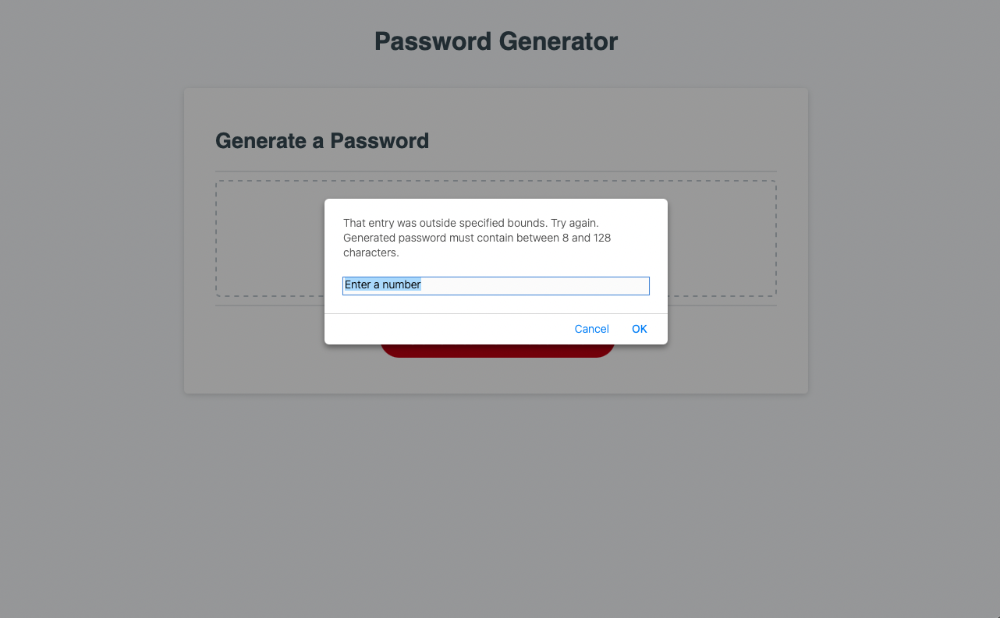

# 03 JavaScript: Password Generator
## Description
A pseudorandom "password" generator. Promts the user for input, validates that input, and generates content to be displayed based on that input.

## Table of Contents (Optional)

- [Installation](#installation)
- [Usage](#usage)
- [Credits](#credits)
- [License](#license)

## Installation

This project is live on github pages, and the code can be viewed on the repo.

* [github repo here](https://github.com/jamesyoungGHusername/Challenge3-StringGenerator)

* [github pages deployment here](https://jamesyoungghusername.github.io/Challenge3-StringGenerator/)

## Usage
Do not use this to generate actual passwords to be used. The generation is pseudorandom. The page should prompt the user for input when they click the generate password button, and then use that input to generate a custom password.

Upon clicking "generate new password" the user should be prompted by a popup to enter a number. The function is recursive and will verify the input and keep asking if the user attempts to submit an invalid number.

After the entry is verified, the page displays a checkbox form of the available character sets their password can be built from. I chose this over a longer sequence of y/n popup prompts to prioritize user experience.

Finally, after all prerequisites are met the page generates a password using the supplied information.

## Credits
### webpages used as a reference
https://www.w3schools.com/js/js_htmldom_html.asp

## License

MIT license.

